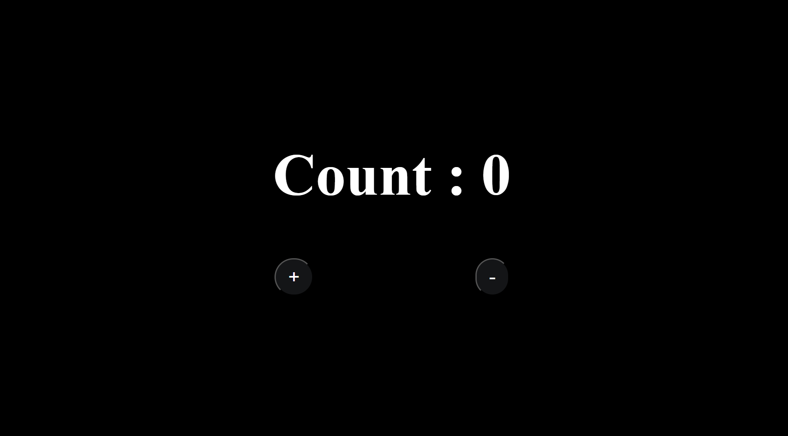
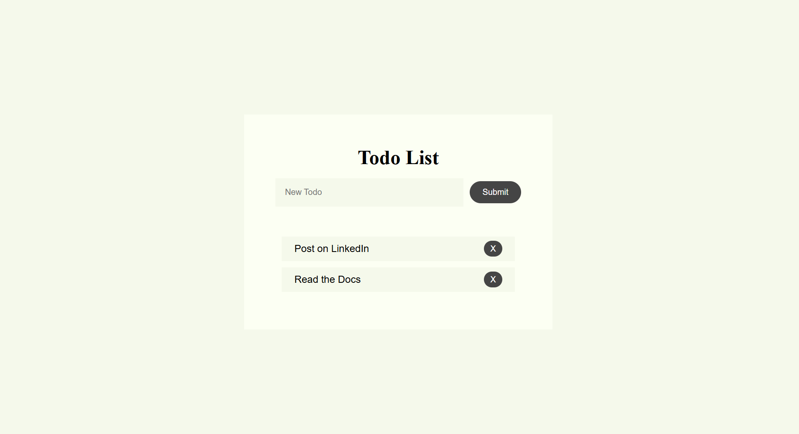
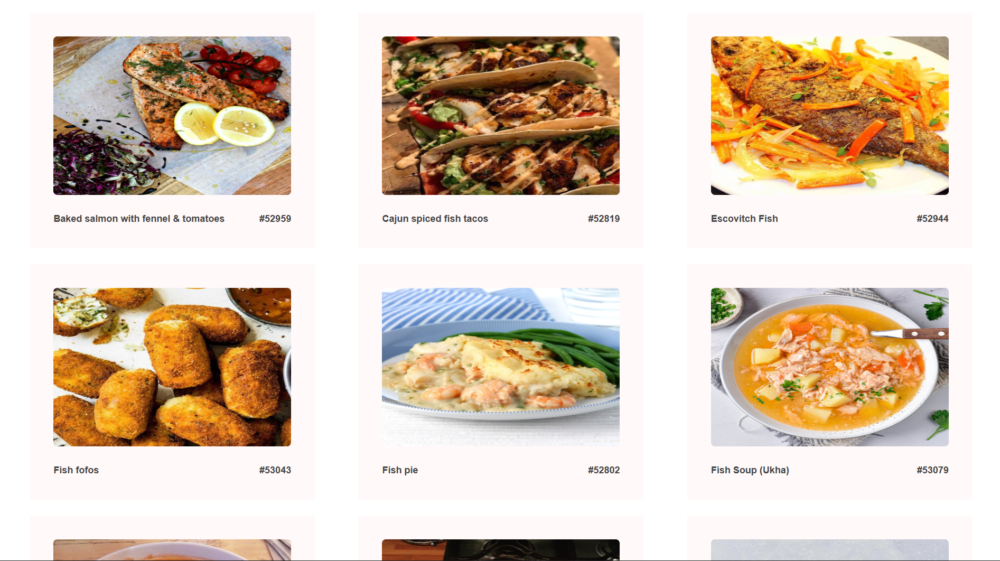
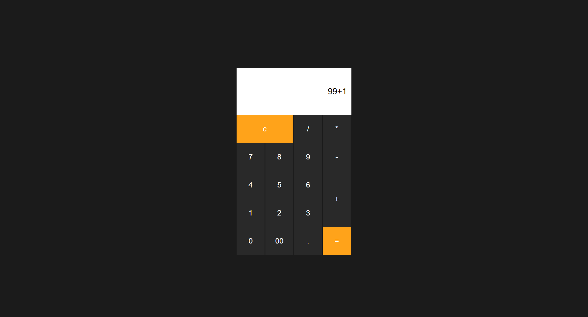
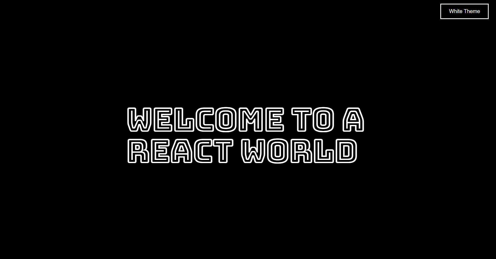
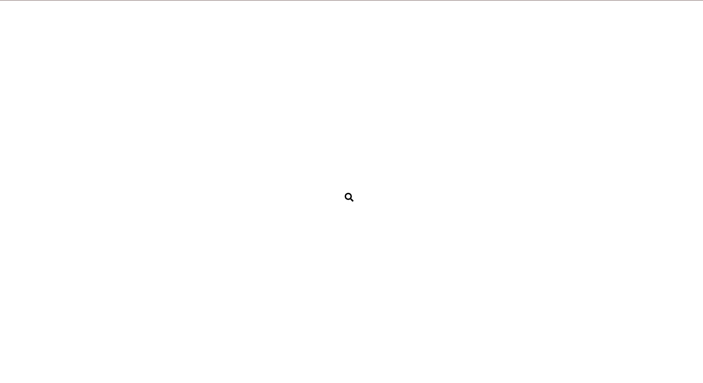
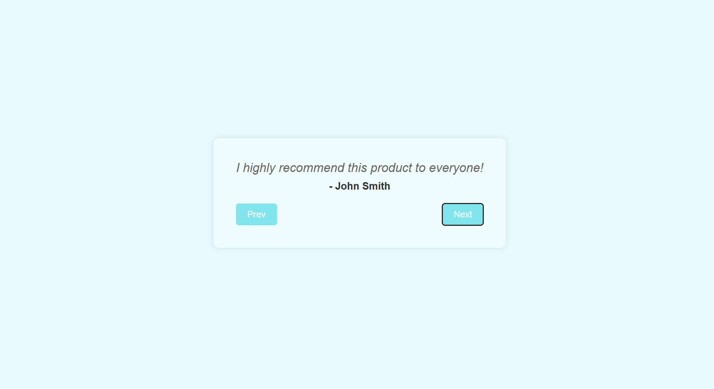
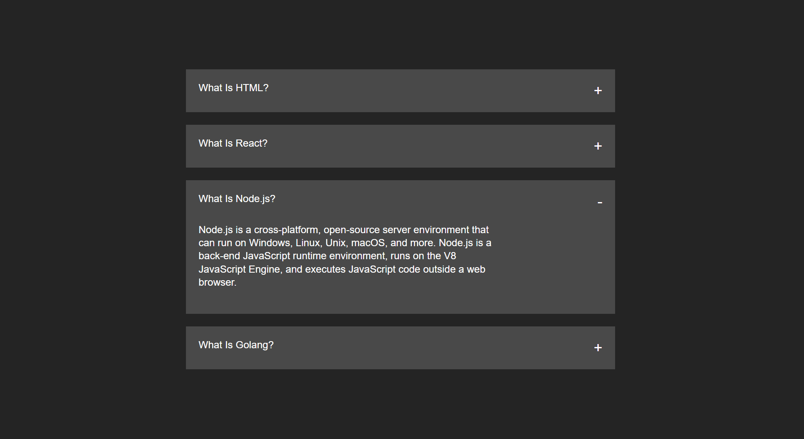
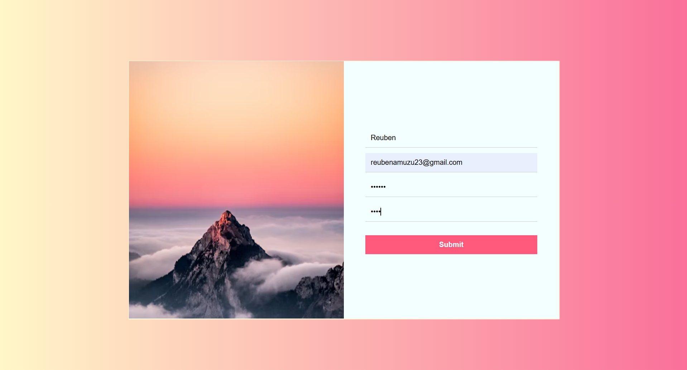

# React Mini Projects

A curated collection of interactive React applications showcasing modern Ui design , state management, API integration, and component architecture. Built with React hooks and best practices.

## 🚀 Projects Overview

### 1. Counter App
A simple counter application demonstrating React state management and event handling.

**Features:**
- Increment/Decrement functionality
- Clean, minimal UI

**Tech Stack:** React, CSS

---

### 2. Todo List
A fully functional todo list with CRUD operations.

**Features:**
- Add and delete tasks
- Local state management

**Tech Stack:** React, CSS

---

### 3. Meal Recipe API
Dynamic recipe browsing application using TheMealDB API.

**Features:**
- Fetches seafood recipes from external API
- Async data handling with Axios
- Responsive recipe cards
- Loading and error states

**Tech Stack:** React, Axios, REST API, CSS

**API:** [TheMealDB](https://www.themealdb.com/api.php)

---

### 4. Calculator
Functional calculator with standard operations.

**Features:**
- Basic arithmetic operations (+, -, ×, ÷)
- Decimal support
- Clear/Reset functionality
- Responsive button layout

**Tech Stack:** React, CSS

---

### 5. Theme Toggle
Dynamic theme switcher with light/dark mode.

**Features:**
- Toggle between light and dark themes
- Smooth color transitions
- Persistent styling with React state
- Modern UI design

**Tech Stack:** React, CSS

---

### 6. Hidden Search Bar
Interactive search component with expand/collapse animation.

**Features:**
- Click-to-expand search input
- Click-outside to close
- Dynamic background color changes
- Icon integration with React Icons

**Tech Stack:** React, React Icons, CSS

---

### 7. Testimonials Carousel
Testimonial slider with navigation controls.

**Features:**
- Previous/Next navigation
- Boundary detection (no infinite loop)
- Disabled state for edge cases
- Smooth transitions

**Tech Stack:** React, CSS

---

### 8. Accordion Component
Expandable/collapsible content sections.

**Features:**
- Toggle individual sections
- Single or multiple open sections
- Smooth expand/collapse animations
- Reusable component structure

**Tech Stack:** React, CSS

---

### 9. Form Validation
Registration form with real-time validation and visual feedback.

**Features:**
- Real-time field validation
- Password strength checking
- Confirm password matching
- Visual feedback (red/green borders)
- Error messages
- Email format validation

**Tech Stack:** React, CSS

## 🛠️ Technologies Used

- **React 18+** - UI library
- **React Hooks** - useState, useEffect
- **Axios** - HTTP client for API calls
- **React Icons** - Icon library
- **CSS3** - Styling and animations
- **REST APIs** - External data integration

## 📦 Installation & Setup

1. **Clone the repository**
```bash
git clone https://github.com/Amson-tECH/react-portfolio-projects.git
cd react-mini-projects
```

2. **Navigate to a specific project**
```bash
cd 01-react-counter-app
```

3. **Install dependencies**
```bash
npm install
```

4. **Run the development server**
```bash
npm start
```


## 📸 Project Previews

<table>
  <tr>
    <td width="50%">
      <h3 align="center">Counter App</h3>
      
    </td>
    <td width="50%">
      <h3 align="center">Todo List</h3>
      
    </td>
  </tr>
  <tr>
    <td width="50%">
      <h3 align="center">Meal Recipe API</h3>
      
    </td>
    <td width="50%">
      <h3 align="center">Calculator</h3>
      
    </td>
  </tr>
  <tr>
    <td width="50%">
      <h3 align="center">Theme Toggle</h3>
      
    </td>
    <td width="50%">
      <h3 align="center">Hidden Search Bar</h3>
      
    </td>
  </tr>
  <tr>
    <td width="50%">
      <h3 align="center">Testimonials</h3>
      
    </td>
    <td width="50%">
      <h3 align="center">Accordion</h3>
      
    </td>
  </tr>
  <tr>
    <td width="50%">
      <h3 align="center">Form Validation</h3>
      
    </td>
    <td width="50%">
    </td>
  </tr>
</table>

## 💻 Running Projects Locally

Each project can be run independently. Follow the installation steps below to test any project on your local machine.

## 📁 Project Structure

```
react-mini-projects/
├── 01-react-counter-app/
├── 02-react-todo-list/
├── 03-react-mealrecipe-api/
├── 04-react-calculator/
├── 05-react-togglebackgroundcolor/
├── 06-react-hidden_search_bar/
├── 07-react-testimonails/
├── 08-react-accordion/
├── 09-react-formvalidation/
└── README.md
```

## 🎯 Key Learning Outcomes

- ✅ React component architecture
- ✅ State management with useState
- ✅ Side effects with useEffect
- ✅ API integration and async operations
- ✅ Form handling and validation
- ✅ Conditional rendering
- ✅ Event handling
- ✅ Component styling and CSS
- ✅ Controlled vs uncontrolled components
- ✅ Props and component composition


## 👨‍💻 Author

**Reuben Korsi Amuzu**
- GitHub: [@Amson-tECH](https://github.com/Amson-tECH)
- LinkedIn: [Reuben Korsi Amuzu](www.linkedin.com/in/reuben-korsi-amuzu-b4bb82385)


## 🤝 Contributing

Contributions, issues, and feature requests are welcome! Feel free to check the [issues page](https://github.com/Amson-tECH/react-portfolio-projects/issues).

## ⭐ Show Your Support

Give a ⭐️ if you like these projects!

---

**Built with ❤️ and React**


<!-- 
# React + Vite Skills Portfolio

A collection of 10 simple React projects built to enhance my fundamental React and Vite skills. Each project focuses on different concepts and features of React development.

## 🎯 Purpose

This repository contains beginner to intermediate React projects that demonstrate:
- Core React concepts (components, state, props, hooks)
- API integration and data fetching
- Form handling and user input
- Component styling with CSS
- Building interactive user interfaces

## 📂 Projects Overview

### ✅ Completed Projects (4/10)

1. **01-react-counter-app**
   - Simple counter application
   - Demonstrates state management with `useState`

2. **02-react-todo-list**
   - Todo list with add/remove functionality
   - Practice with lists, forms, and state updates

3. **03-react-mealrecipe-api**
   - Fetches and displays seafood recipes from TheMealDB API
   - API integration using Axios
   - Dynamic data rendering

4. **04-react-calculator**
   - Functional calculator application
   - Complex state management and event handling

5. **05-react-togglebackgroundcolor**
   - It uses a theme toggle component that allows users to switch between light and dark modes by clicking a button, which dynamically changes the background color, text color, and button styling using React's useState hook.


## 🛠️ Technologies Used

- **React 18+** - UI library
- **Vite** - Fast build tool and development server
- **Axios** - HTTP client for API requests
- **CSS3** - Styling
- **JavaScript (ES6+)** - Programming language

## 📦 Installation & Setup

1. Clone the repository:
   ```bash
   git clone https://github.com/Amson-tECH/react-projects-portfolio.git
   cd react-projects-portfolio
   ```

2. Navigate to any project folder:
   ```bash
   cd 01-react-counter-app
   ```

3. Install dependencies:
   ```bash
   npm install
   ```

4. Start the development server:
   ```bash
   npm run dev
   ```


## 📝 Project Structure

```
react-projects-portfolio/
├── 01-react-counter-app/
├── 02-react-todo-list/
├── 03-react-mealrecipe-api/
├── 04-react-calculator/
├── 05-react-togglebackgroundcolor/
├── and counting ...
└── README.md
```

Each project folder contains:
- Source code (`src/`)
- Component files (`.jsx`)
- Styling files (`.css`)
- Individual README file

## 🎓 Learning Goals

Through these projects, I'm learning:
- ✅ Component-based architecture
- ✅ State and props management
- ✅ React Hooks (`useState`, `useEffect`, `useReducer`)
- ✅ API integration and data fetching
- ✅ Event handling and forms
- ✅ Conditional rendering
- ✅ Custom hooks creation
- ✅ List rendering and keys
- 🔄 React Router and navigation
- 🔄 Context API and global state

## 🚀 Progress Tracker

- [x] Project 1: Counter App
- [x] Project 2: Todo List
- [x] Project 3: Meal Recipe API
- [x] Project 4: Calculator
- [x] Project 5: Toggle Background Color (Dark mode & Light mode)
- [ ] Project 6: Coming Soon
- [ ] Project 7: Coming Soon
- [ ] Project 8: Coming Soon
- [ ] Project 9: Coming Soon
- [ ] Project 10: Coming Soon

**Current Progress: 50% Complete (5/10)**

## 💡 Key Takeaways

Each project has taught me valuable lessons:
- **Project 1**: Understanding state and re-rendering
- **Project 2**: Working with arrays in state
- **Project 3**: Fetching external data and error handling
- **Project 4**: Complex state logic and calculations


## 📧 Contact

**Amson-tECH**
- GitHub: [@Amson-tECH](https://github.com/Amson-tECH)


---

*Last Updated: October 2025*  
*Status: 5/10 Projects Complete* 🚀 -->